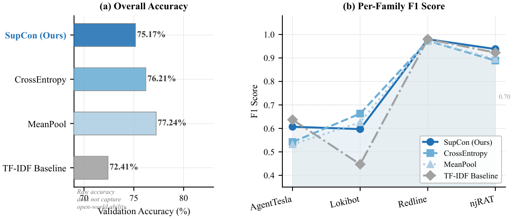
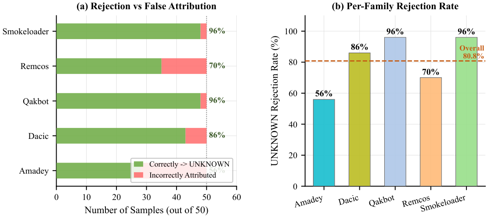
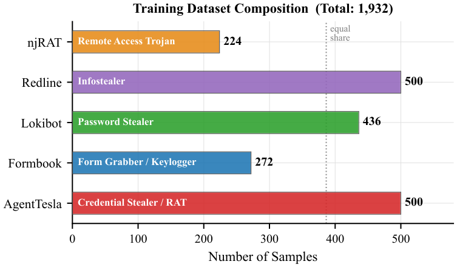

# PHENOTYPE

**Behavioural DNA Framework for Malware Attribution**


> Classify malware by what it does, not what it looks like.

PHENOTYPE encodes Windows API call sequences (from CAPE Sandbox dynamic analysis) into 256-dimensional behavioural fingerprints using a Transformer encoder trained with Supervised Contrastive Loss. At inference, cosine similarity against per-family centroids either attributes a sample to a known family or labels it **UNKNOWN** — no retraining required for open-world rejection.

**[Research Paper](paper/phenotype_malai_2026.pdf)**

---

## Results

### Closed-World Attribution — 5 families, 290 test samples, θ = 0.986

| Family | Precision | Recall | F1 | Support |
|---|---|---|---|---|
| AgentTesla | 0.636 | 0.467 | 0.538 | 75 |
| Formbook | 0.743 | 0.634 | 0.684 | 41 |
| Lokibot | 0.489 | 0.677 | 0.568 | 65 |
| Redline | 0.973 | 0.960 | **0.966** | 75 |
| njRAT | 0.861 | 0.912 | **0.886** | 34 |
| **Macro** | 0.740 | 0.730 | **0.729** | 290 |

**Test accuracy: 71.72%** · ~680K parameters · 2.7 MB on disk · CPU inference in tens of ms

### Open-World Novelty Rejection — 5 unseen families, 250 samples

| Novel Family | Rejected as UNKNOWN | Rejection Rate |
|---|---|---|
| Amadey | 28 / 50 | 56% |
| Dacic | 43 / 50 | 86% |
| Qakbot | 48 / 50 | **96%** |
| Remcos | 35 / 50 | 70% |
| Smokeloader | 48 / 50 | **96%** |
| **Overall** | **202 / 250** | **80.8%** |

Cross-entropy trained models achieve **0%** open-world rejection by design — every novel sample gets forced into a known family. The SupCon geometry is what makes rejection possible.

---

## Architecture

```
Token Sequence (1,200 × int64)
        │
   Embedding  (vocab = 100 → d = 128, padding_idx = 0)
        │
   Sinusoidal Positional Encoding
        │
   4 × TransformerEncoderLayer
       (d_model=128, nhead=8, d_ff=512, GELU, Pre-LN, dropout=0.1)
        │
   Attention Pooling  (single learnable query vector)
        │
   Linear (128 → 256)  +  L2 Normalise
        │
   Behavioural Fingerprint  (256-dim, unit hypersphere)
        │
   Cosine Similarity vs 5 Family Centroids
        ├─ score ≥ 0.986  →  Attributed family
        └─ score  < 0.986  →  UNKNOWN
```

**Loss:** Supervised Contrastive Loss (`τ = 0.07`)  
**Optimiser:** AdamW (`lr=3e-4`, `weight_decay=1e-4`)  
**Schedule:** Linear warmup (10%) → cosine decay  
**Sampler:** StratifiedBatchSampler — all 5 families present every batch  

---

## Figures

| | |
|---|---|
|  |  |
| *Fig 1 — End-to-end system architecture* | *Fig 2 — Training loss and per-family validation F1* |
|  |  |
| *Fig 3 — Ablation accuracy vs per-family F1* | *Fig 4 — Open-world rejection rates* |
|  |  |
| *Fig 5 — Cosine similarity distributions* | *Fig 6 — Training dataset composition* |

---

## Quickstart

```bash
# 1. Install
pip install -r requirements.txt

# 2. Train  (requires final_dna_v2.csv — see Dataset section)
python train.py --csv final_dna_v2.csv --out_dir outputs/run1 --epochs 100

# 3. Attribute a sample
python attribute.py \
    --csv_row final_dna_v2.csv --row_idx 42 \
    --encoder outputs/run1/behaviour_encoder.pt \
    --centroids outputs/run1/family_centroids.pt
```

---

## All Scripts

| Script | What it does |
|---|---|
| `train.py` | Train the encoder with SupCon loss. Saves checkpoint, centroids, logs, and test report. |
| `attribute.py` | Attribute one sample by cosine similarity. Accepts a CSV row or raw token integers. |
| `explain.py` | Gradient × input attribution. Shows which API calls drove the prediction. |
| `eval_held_out.py` | Open-world evaluation on novel families. Outputs per-family rejection rates. |
| `ablation.py` | Runs all 4 variants: SupCon, CrossEntropy, MeanPool, TF-IDF baseline. |
| `confusion_matrix.py` | Normalised confusion matrix plot on the test set. |
| `visualise.py` | t-SNE cluster plot of the 256-dim fingerprint space. |
| `dashboard.py` | Streamlit demo — upload a CAPE report or paste tokens for live attribution. |
| `make_paper_figs.py` | Regenerate all IEEE-quality figures from saved outputs. |
| `make_tsne.py` | Regenerate the publication t-SNE (mode `b` works without model weights). |
| `run_extraction.py` | CAPE `report.json` → 1,200-token sequence. |
| `append_volume.py` | Add a new WinMET volume to an existing dataset CSV. |
| `extract_held_out.py` | Build the held-out test CSV from novel families. |

### Key flags

```bash
# Train on GPU
python train.py --csv final_dna_v2.csv --out_dir outputs/run1 --device cuda --epochs 100

# Explain a prediction
python explain.py --csv_row final_dna_v2.csv --row_idx 0 \
    --encoder outputs/run1/behaviour_encoder.pt \
    --centroids outputs/run1/family_centroids.pt \
    --method gradient --out outputs/run1/explanation.png

# Open-world eval
python eval_held_out.py --csv data/held_out_families.csv \
    --encoder outputs/run1/behaviour_encoder.pt \
    --centroids outputs/run1/family_centroids.pt

# Live dashboard
streamlit run dashboard.py
```

---

## Dataset

### What is tracked

| File | Size | Description |
|---|---|---|
| `data/final_dna_v2_vocab.json` | 2.4 KB | 100-token API vocabulary (2 special + 98 HIGH_SIGNAL names) |
| `data/held_out_families.csv` | 730 KB | 250 samples from 5 novel families (open-world test set) |

### What is not tracked

`final_dna_v2.csv` (1,932 samples × 1,203 columns, ~5.5 MB) is excluded — it contains processed malware traces. To reproduce it from WinMET sandbox reports:

```bash
python run_extraction.py --volumes /path/to/winmet/vol1 /path/to/winmet/vol2
python append_volume.py --volume /path/to/winmet/vol3   # repeat for vols 4–5
python extract_held_out.py --volumes /path/to/winmet/vol1 ...
```

The vocabulary file is already provided — the extraction scripts use it directly.

### Training set composition

| Family | Type | Samples |
|---|---|---|
| AgentTesla | Credential Stealer + RAT | 500 |
| Formbook | Form Grabber / Keylogger | 272 |
| Lokibot | Password Stealer | 436 |
| Redline | Infostealer | 500 |
| njRAT | Remote Access Trojan | 224 |
| **Total** | | **1,932** |

Each sample is a 1,200-token sequence of integer IDs representing the malware's Windows API call trace, filtered to 98 HIGH_SIGNAL behavioural indicators from a 157-call candidate set.

---

## Ablation

| Model | Accuracy | AT F1 | LB F1 | RD F1 | Open-World |
|---|---|---|---|---|---|
| **Transformer + SupCon (Ours)** | 75.17% | 0.607 | 0.597 | 0.980 | **80.8%** |
| Transformer + CrossEntropy | 76.21% | 0.542 | 0.663 | 0.973 | 0% |
| Transformer + MeanPool | 77.24% | 0.532 | 0.626 | 0.973 | 0% |
| TF-IDF + LogReg | 72.41% | 0.637 | 0.447 | 0.980 | 0% |

Higher raw accuracy does not mean better deployment. CrossEntropy and MeanPool both beat SupCon on validation accuracy while being completely blind to novel families.

---

## Key Findings

**Redline and njRAT** form tight, well-separated clusters (F1 0.966 and 0.886). Redline's trace is dominated by registry writes and credential file I/O; njRAT by remote thread creation and shell execution — both distinctive enough that the model rarely confuses them with anything else.

**AgentTesla and Lokibot** are the hard case. Both credential stealers rely on the same memory and filesystem primitives (`NtAllocateVirtualMemory`, `NtCreateFile`, `FindNextFileW`). 48% of AgentTesla test samples are misclassified as Lokibot — this is a genuine limit of API-name-level attribution for this family pair, not a modelling failure. The t-SNE confirms it: Redline and njRAT sit in isolated corners of the fingerprint space, AgentTesla and Lokibot intermix in the centre.

**Amadey's 44% false attribution rate** is the open-world result worth understanding. Amadey is a dropper whose main observable behaviour is registry writes and file creation — the same calls that define the Redline centroid. The model places it in the geometrically nearest training region, which happens to be functionally similar. The attribution is wrong in label but coherent in geometry.

**The TF-IDF baseline reaching 72.41%** (within 3 points of the Transformer) was a result that made us reconsider what the Transformer is actually adding. The answer is the embedding geometry — a TF-IDF classifier has no way to say "this sample is outside all known families." That is the capability SupCon buys.

---

## Repository Structure

```
phenotype-malai/
├── model.py              — BehaviourEncoder (Transformer + AttentionPooling + L2 norm)
├── dataset.py            — MalwareDataset, StratifiedBatchSampler, make_splits()
├── train.py              — SupConLoss training loop, LR schedule, checkpoint saving
├── attribute.py          — Cosine similarity attribution engine (θ = 0.986)
├── explain.py            — Gradient × input and KernelSHAP explanations
├── eval_held_out.py      — Open-world evaluation on held-out families
├── ablation.py           — 4-variant ablation study
├── confusion_matrix.py   — Normalised confusion matrix
├── visualise.py          — t-SNE fingerprint cluster plot
├── dashboard.py          — Streamlit interactive demo
├── run_extraction.py     — CAPE report.json → token sequence
├── append_volume.py      — Add WinMET volumes to dataset incrementally
├── extract_held_out.py   — Build held-out novel-family test CSV
├── make_paper_figs.py    — Generate IEEE-quality publication figures
├── make_tsne.py          — Generate publication t-SNE
│
├── data/
│   ├── final_dna_v2_vocab.json   — 100-token API vocabulary
│   └── held_out_families.csv     — 250-sample open-world test set
│
├── paper/
│   └── phenotype_malai_2026.pdf  — Research paper (IEEE format)
│
├── figs/                 — Publication figures (fig1–fig7 + t-SNE)
├── outputs/
│   └── batch_size64/     — Training logs, metrics, result plots
│
├── requirements.txt
├── LICENSE               — MIT
└── CITATION.cff
```

---

## Troubleshooting

| Symptom | Fix |
|---|---|
| `TSNE.__init__() unexpected keyword 'n_iter'` | scikit-learn ≥ 1.5: replace `n_iter=` with `max_iter=` in `visualise.py` |
| All samples predicted as one family | Check `StratifiedBatchSampler` and class weights in `dataset.py` |
| All similarities ≈ 0.5 | Adjust temperature (try 0.05–0.15), verify L2 normalisation is active |
| NaN loss | Reduce LR, confirm gradient clipping is on (`max_norm=1.0`) |
| `charmap codec can't encode` on Windows | Print encoding issue only — does not affect saved output files |
| Extraction: 0 active tokens | Run `print(report.get('behavior',{}).keys())` to check CAPE report structure |

---

## Citation

```bibtex
@inproceedings{phenotype2026,
  author    = {Singh, Harmanpreet and Joshi, Parwaaz and
               Singh, Arshdeep and Sehrawat, Priyansh},
  title     = {{PHENOTYPE}: Contrastive Behavioural Fingerprinting
               for Open-World Malware Attribution},
  year      = {2026},
  institution = {Chandigarh University},
  note      = {Transformer + Supervised Contrastive Loss for Windows
               API call sequence fingerprinting. 71.72\% closed-world
               accuracy; 80.8\% open-world rejection on 5 novel families.}
}
```

A `CITATION.cff` is provided for GitHub's "Cite this repository" button.

---

## License

MIT — see [LICENSE](LICENSE).

*Supervisor: Prof. Sidrah Fayaz Wani · Chandigarh University · 2026*  
*Authors: Harmanpreet Singh · Parwaaz Joshi · Arshdeep Singh · Priyansh Sehrawat*
