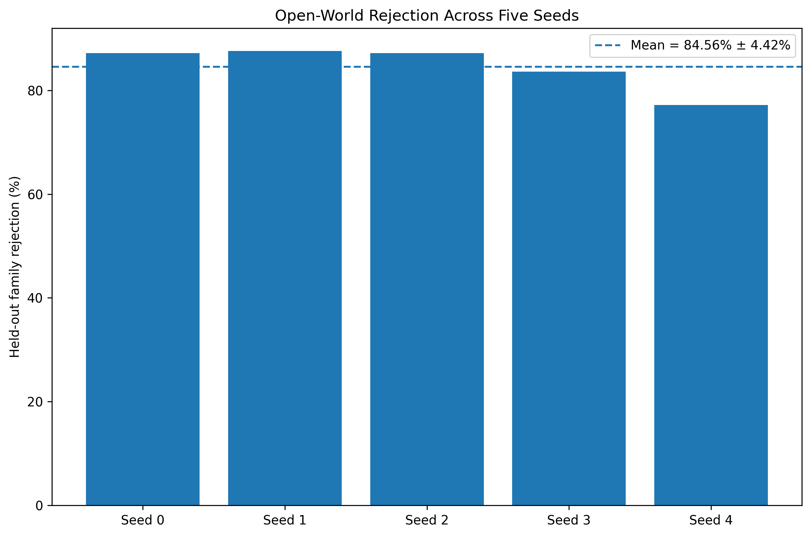
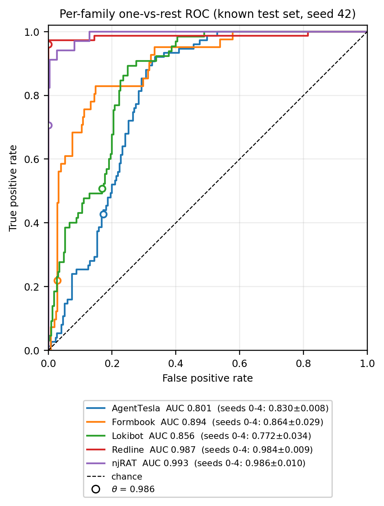
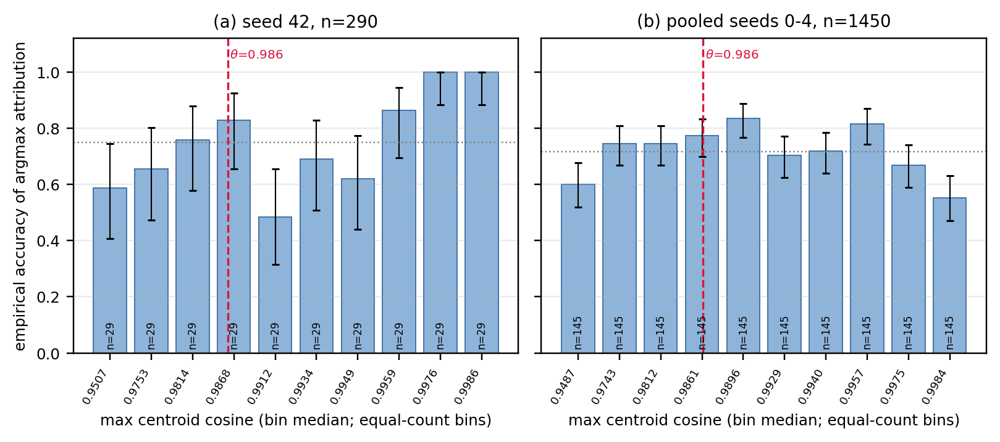
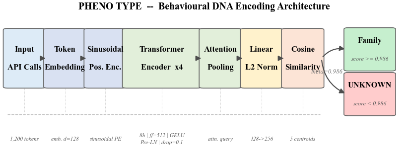

# PHENOTYPE

**Behavioural DNA Framework for Malware Attribution**


> Classify malware by what it does, not what it looks like.

PHENOTYPE encodes Windows API call sequences (from CAPE Sandbox dynamic analysis) into 256-dimensional behavioural fingerprints using a Transformer encoder trained with Supervised Contrastive Loss. At inference, cosine similarity against per-family centroids either attributes a sample to a known family or labels it **UNKNOWN**, with no retraining needed for open-world rejection.

**Accepted at ICISS 2026** — *PHENOTYPE: Contrastive Behavioural Fingerprinting for Open-World Malware Attribution.*

---

## Results

Headline numbers are **mean ± std over five seeds (0–4)**; the per-family tables and figures use **seed 42** as the representative run. Split: 70/15/15 (1,352 / 290 / 290), threshold θ = 0.986.

| Metric | Value |
|---|---|
| Closed-world accuracy (290 test samples) | **71.5 ± 1.5%** (seed 42: 74.8%) |
| Macro-F1 | **0.724 ± 0.018** |
| Novel-family rejection (250 samples, 5 unseen families) | **84.6 ± 4.4%** (range 77.2–87.6%) |
| Known test samples accepted at θ | 65.4 ± 3.4% |
| Known-vs-novel AUROC (seed 42) | 0.85 |
| Parameters / size | 839,040 / 3.36 MB (fp32) |

### Closed-world attribution (seed 42)

| Family | Precision | Recall | F1 | Support |
|---|---|---|---|---|
| AgentTesla | 0.654 | 0.453 | 0.535 | 75 |
| Formbook | 0.667 | 0.683 | 0.675 | 41 |
| Lokibot | 0.580 | 0.785 | 0.667 | 65 |
| Redline | 0.986 | 0.973 | **0.980** | 75 |
| njRAT | 0.912 | 0.912 | **0.912** | 34 |
| **Macro** | 0.760 | 0.761 | **0.754** | 290 |

### Open-world novelty rejection (seed 42)

| Novel family | Rejected as UNKNOWN | Rejection rate | Most common wrong attribution |
|---|---|---|---|
| Amadey | 42 / 50 | 84% | Redline (7) |
| Dacic | 44 / 50 | 88% | Redline (5) |
| Qakbot | 50 / 50 | **100%** | — |
| Remcos | 33 / 50 | 66% | Lokibot (13) |
| Smokeloader | 48 / 50 | 96% | Redline (2) |
| **Overall** | **217 / 250** | **86.8%** | |

Rejection varies a lot across training seeds (77.2% to 87.6%), so quote the five-seed figure (84.6 ± 4.4%) rather than any single run.



### Comparison with open-set baselines (five seeds, same held-out families)

| Method | Novel-family rejection (mean) | Paired t-test vs PHENOTYPE |
|---|---|---|
| **PHENOTYPE (SupCon + centroid cosine)** | **84.6%** | — |
| MSP-thresholded CrossEntropy | 80.3% | p = 0.37 (not significant) |
| OpenMax | 38.8% | p = 0.0001 |
| One-Class SVM (per-family) | 34.5% | p = 0.003 |
| CADE | 16.1% | p = 0.0007 |
| Energy-based OOD | 4.2% | p < 0.0001 |

Wilcoxon p-values are 0.0625 for four baselines and 0.5 for MSP, the minimum attainable with five paired seeds. **PHENOTYPE is not significantly better than a CrossEntropy model with a max-softmax-probability threshold** (80.3 ± 8.0% vs 84.6 ± 4.4%). The contrastive model's advantage over that baseline is lower variance across seeds, not a proven higher mean. A plain argmax CrossEntropy classifier rejects nothing, because it forces every novel sample into a known family.

---

## Additional analyses (reviewer-requested)

Produced by `reviewer_analyses.py` from the saved checkpoints by inference only (no retraining). Outputs, logs and a README are in `outputs/reviewer_analyses/`.

### Per-family ROC (one-vs-rest, cosine to that family's centroid)

| Family | AUC (seed 42) | AUC (seeds 0–4, mean ± std) |
|---|---|---|
| AgentTesla | 0.801 | 0.830 ± 0.008 |
| Formbook | 0.894 | 0.864 ± 0.029 |
| Lokibot | 0.856 | 0.772 ± 0.034 |
| Redline | 0.987 | 0.984 ± 0.009 |
| njRAT | 0.993 | 0.986 ± 0.010 |

Seed 42 is optimistic for Lokibot (0.856 vs a five-seed mean of 0.772).



### Accuracy vs maximum centroid cosine

Cosine similarity is not a calibrated probability, so this reports empirical accuracy across equal-count similarity bins rather than a conventional reliability diagram. **Accuracy is not a monotone function of the maximum cosine.** The correct-vs-incorrect AUROC of the max-cosine score is 0.67 on seed 42 but averages **0.49 across seeds 0–4 (range 0.37–0.61)**, i.e. close to chance. Seed 42 reaches 100% accuracy in its two highest-similarity bins, but pooled over seeds 0–4 the highest-similarity bin has the lowest accuracy of all ten (55.2%). The score is useful for rejecting novel families, not for estimating confidence in a known-family attribution.



### Latency and throughput

Seed-42 checkpoint, fp32, `inference_mode`, sequence length 1,200, real test tokens. Stage A is token tensor to 256-d embedding; stage B adds the centroid cosine and threshold decision. Host-to-GPU input copy is excluded; returning the decision to the host is included in stage B. End-to-end timing from raw CAPE JSON (stage C) was **not measured**, and CPU batch 64 was not measured.

| Device | Stage | Batch | Median (ms) | P95 (ms) | Throughput (samples/s) |
|---|---|---:|---:|---:|---:|
| Colab CPU (2 vCPU Xeon 2.0 GHz, 1 PyTorch thread) | A | 1 | 576.76 | 900.85 | 1.7 |
| Colab CPU (same) | B | 1 | 573.30 | 888.23 | 1.7 |
| Colab Tesla T4 | A | 1 | 9.00 | 9.27 | 111.1 |
| Colab Tesla T4 | B | 1 | 9.17 | 9.51 | 109.0 |
| Colab Tesla T4 | A | 64 | 533.70 | 552.86 | 119.9 |
| Colab Tesla T4 | B | 64 | 612.20 | 620.49 | 104.5 |

CPU rows use 200 repetitions after 10 warmup passes; GPU rows use 1,000 (batch 1) and 100 (batch 64) repetitions after 50 warmup passes. Batching did not meaningfully raise GPU throughput. Full environment details are in `outputs/reviewer_analyses/environment.json`.

---

## Architecture

```
Token Sequence (1,200 × int64)
        │
   Embedding  (vocab = 100 → d = 128, padding_idx = 0)
        │
   Sinusoidal Positional Encoding
        │
   4 × TransformerEncoderLayer
       (d_model=128, nhead=8, d_ff=512, GELU, Pre-LN, dropout=0.1)
        │
   Attention Pooling  (single learnable query vector)
        │
   Linear (128 → 256)  +  L2 Normalise
        │
   Behavioural Fingerprint  (256-dim, unit hypersphere)
        │
   Cosine Similarity vs 5 Family Centroids
        ├─ score ≥ 0.986  →  Attributed family
        └─ score  < 0.986  →  UNKNOWN
```

**Loss:** Supervised Contrastive Loss (`τ = 0.07`)
**Optimiser:** AdamW (`lr=3e-4`, `weight_decay=1e-4`)
**Schedule:** Linear warmup (10%) → cosine decay
**Sampler:** StratifiedBatchSampler — all 5 families present every batch



---

## Quickstart

```bash
# 1. Install
pip install -r requirements.txt

# 2. Train one model (requires final_dna_v2.csv — see Dataset section)
python train.py --csv final_dna_v2.csv --out_dir outputs/run1 --epochs 100

# 3. Attribute a sample
python attribute.py \
    --csv_row final_dna_v2.csv --row_idx 42 \
    --encoder outputs/run1/behaviour_encoder.pt \
    --centroids outputs/run1/family_centroids.pt
```

### Reproduce the headline results

```bash
# Five-seed training + open-world evaluation (Tables: accuracy, macro-F1, rejection)
python multi_seed_eval.py --csv final_dna_v2.csv --held_out_csv data/held_out_families.csv \
    --seeds 0 1 2 3 4 --epochs 100 --device cuda

# Paired significance tests against the open-set baselines
python significance_test.py

# Reviewer-requested analyses (per-family ROC, accuracy vs cosine, latency).
# Needs the saved checkpoints in outputs/single_run and outputs/multi_seed/seed_N
python reviewer_analyses.py --repo . --out outputs/reviewer_analyses
```

Model checkpoints (`*.pt`) are not tracked in git; train them with the commands above or obtain them from the authors.

---

## All Scripts

| Script | What it does |
|---|---|
| `train.py` | Train the encoder with SupCon loss. Saves checkpoint, centroids, logs, and test report. |
| `attribute.py` | Attribute one sample by cosine similarity. Accepts a CSV row or raw token integers. |
| `explain.py` | Gradient × input attribution. Shows which API calls drove the prediction. |
| `eval_held_out.py` | Open-world evaluation on novel families. Outputs per-family rejection rates. |
| `multi_seed_eval.py` | Train and evaluate seeds 0–4; produces the five-seed headline numbers. |
| `multi_seed_ablation.py` | Five-seed ablation: SupCon, CrossEntropy, MeanPool, TF-IDF baseline. |
| `ablation.py` | Single-seed ablation of the same four variants. |
| `significance_test.py` | Paired t-tests and Wilcoxon tests of PHENOTYPE against the open-set baselines. |
| `openmax_baseline.py`, `energy_baseline.py`, `cade_baseline.py`, `dmascl_baseline.py`, `oneclass_svm_baseline.py` | Open-set baselines compared in the paper. |
| `compute_open_world_roc.py` | Known-vs-novel ROC and AUROC from saved scores. |
| `compute_fig6_data.py` | Data preparation for paper Fig. 6. |
| `adversarial_eval.py` | Robustness to API-call insertion, deletion and reordering. |
| `reviewer_analyses.py` | Per-family ROC, accuracy vs max cosine, latency/throughput (inference only). |
| `confusion_matrix.py` | Normalised confusion matrix plot on the test set. |
| `visualise.py` | t-SNE cluster plot of the 256-dim fingerprint space. |
| `dashboard.py` | Streamlit demo — upload a CAPE report or paste tokens for live attribution. |
| `scripts/make_paper_figs.py` | Regenerate publication figures from saved outputs. |
| `scripts/make_tsne.py` | Regenerate the publication t-SNE (mode `b` works without model weights). |
| `scripts/run_extraction.py` | CAPE `report.json` → 1,200-token sequence. |
| `scripts/append_volume.py` | Add a new WinMET volume to an existing dataset CSV. |
| `scripts/extract_held_out.py` | Build the held-out test CSV from novel families. |

### Key flags

```bash
# Train on GPU
python train.py --csv final_dna_v2.csv --out_dir outputs/run1 --device cuda --epochs 100

# Explain a prediction
python explain.py --csv_row final_dna_v2.csv --row_idx 0 \
    --encoder outputs/run1/behaviour_encoder.pt \
    --centroids outputs/run1/family_centroids.pt \
    --method gradient --out outputs/run1/explanation.png

# Open-world eval
python eval_held_out.py --csv data/held_out_families.csv \
    --encoder outputs/run1/behaviour_encoder.pt \
    --centroids outputs/run1/family_centroids.pt

# Live dashboard
streamlit run dashboard.py
```

---

## Dataset

### What is tracked

| File | Size | Description |
|---|---|---|
| `data/final_dna_v2_vocab.json` | 2.4 KB | 100-token API vocabulary (2 special + 98 HIGH_SIGNAL names) |
| `data/held_out_families.csv` | 730 KB | 250 samples from 5 novel families (open-world test set) |

### What is not tracked

`final_dna_v2.csv` (1,932 samples × 1,203 columns, ~5.5 MB) is excluded — it contains processed malware traces. To reproduce it from WinMET sandbox reports:

```bash
python scripts/run_extraction.py --volumes /path/to/winmet/vol1 /path/to/winmet/vol2
python scripts/append_volume.py --volume /path/to/winmet/vol3   # repeat for vols 4–5
python scripts/extract_held_out.py --volumes /path/to/winmet/vol1 ...
```

The vocabulary file is already provided — the extraction scripts use it directly.

### Training set composition

| Family | Type | Samples |
|---|---|---|
| AgentTesla | Credential Stealer + RAT | 500 |
| Formbook | Form Grabber / Keylogger | 272 |
| Lokibot | Password Stealer | 436 |
| Redline | Infostealer | 500 |
| njRAT | Remote Access Trojan | 224 |
| **Total** | | **1,932** |

Each sample is a 1,200-token sequence of integer IDs representing the malware's Windows API call trace, filtered to 98 HIGH_SIGNAL behavioural indicators from a 157-call candidate set.

---

## Ablation (five seeds, closed-world)

| Model | Accuracy | AgentTesla F1 | Formbook F1 | Lokibot F1 | Redline F1 | njRAT F1 |
|---|---|---|---|---|---|---|
| Transformer + SupCon | 70.7 ± 2.4% | 0.543 | 0.636 | 0.557 | 0.958 | 0.893 |
| Transformer + CrossEntropy | 72.8 ± 2.6% | 0.586 | 0.652 | 0.574 | 0.963 | 0.907 |
| Transformer + MeanPool | 69.7 ± 4.6% | 0.530 | 0.625 | 0.542 | 0.944 | 0.896 |
| TF-IDF + LogReg | 72.6 ± 2.4% | 0.660 | 0.570 | 0.494 | 0.958 | 0.920 |

`multi_seed_ablation.py` retrains each variant and defaults to 50 epochs (the headline runs use 100), so the SupCon accuracy here differs slightly from the headline 71.5 ± 1.5%. On closed-world accuracy the SupCon model is **not better** than CrossEntropy or the TF-IDF baseline; what SupCon adds is an embedding geometry that supports centroid-based rejection of unseen families.

---

## Key Findings

**Redline and njRAT** form tight, well-separated clusters (seed-42 F1 0.980 and 0.912; five-seed ablation F1 0.958 and 0.893).

**AgentTesla and Lokibot** are the hard case. At seed 42, AgentTesla recall is only 0.453 and Lokibot precision 0.580; see `outputs/single_run/confusion_matrix.png` and the t-SNE in `outputs/single_run/tsne_clusters.png`.

**Novel-family rejection is seed- and family-dependent.** Across five seeds it ranges from 77.2% to 87.6%. At seed 42, Qakbot is rejected completely and Remcos only 66% of the time, with 13 Remcos samples attributed to Lokibot.

**Contrastive training vs a thresholded softmax.** PHENOTYPE rejects more novel samples than any other open-set baseline we tested on average, but the gap to a CrossEntropy model with a max-softmax-probability threshold (80.3 ± 8.0% vs 84.6 ± 4.4%) is not statistically significant (paired t-test p = 0.37, n = 5 seeds).

**The maximum cosine similarity does not tell you whether an attribution is correct** (correct-vs-incorrect AUROC 0.49 ± 0.11 across seeds), only whether a sample looks like any known family.

**A TF-IDF baseline matches the Transformer on closed-world accuracy** (72.6% vs 70.7% for SupCon), so the Transformer's contribution is the embedding geometry rather than raw accuracy.

---

## Limitations

- Only 1,932 samples across five families; Formbook and njRAT are under-represented, which affects centroid quality.
- All data comes from CAPE, so API calls CAPE does not hook are invisible to the model.
- Train, validation and test splits come from the same WinMET snapshot, so there is no distribution shift (for example quarterly malware evolution) in the evaluation.
- Five seeds give limited statistical power; non-parametric tests cannot reach p < 0.0625 with n = 5.
- CPU inference was measured on a single PyTorch thread of a 2-vCPU Colab VM and takes about 0.58 s per sample; GPU inference takes about 9 ms. End-to-end latency from raw CAPE reports was not measured.

---

## Repository Structure

```
PhenoType-DNA-MalAI/
├── model.py                 — BehaviourEncoder (Transformer + AttentionPooling + L2 norm)
├── dataset.py               — MalwareDataset, StratifiedBatchSampler, make_splits()
├── train.py                 — SupConLoss training loop, LR schedule, checkpoint saving
├── attribute.py             — Cosine similarity attribution engine (θ = 0.986)
├── explain.py               — Gradient × input and KernelSHAP explanations
├── eval_held_out.py         — Open-world evaluation on held-out families
├── multi_seed_eval.py       — Five-seed training and evaluation
├── multi_seed_ablation.py   — Five-seed ablation
├── ablation.py              — Single-seed ablation
├── significance_test.py     — Paired tests vs open-set baselines
├── *_baseline.py            — OpenMax, Energy, CADE, DMASCL, One-Class SVM baselines
├── compute_open_world_roc.py, compute_fig6_data.py
├── adversarial_eval.py      — Perturbation robustness
├── reviewer_analyses.py     — Per-family ROC, accuracy vs cosine, latency
├── confusion_matrix.py, visualise.py, dashboard.py
│
├── scripts/                 — extraction and figure scripts
│   ├── run_extraction.py, append_volume.py, extract_held_out.py
│   └── make_paper_figs.py, make_tsne.py
│
├── data/
│   ├── final_dna_v2_vocab.json   — 100-token API vocabulary
│   └── held_out_families.csv     — 250-sample open-world test set
│
├── paper/                   — Research paper
├── figs/                    — Publication figures
├── outputs/
│   ├── single_run/          — Seed-42 representative run
│   ├── multi_seed/          — Seeds 0–4 (headline numbers)
│   ├── significance/        — Paired tests vs baselines
│   ├── ablation/, ablation_multi_seed/
│   ├── adversarial/
│   ├── *_baseline/          — Open-set baseline results
│   ├── reviewer_analyses/   — Per-family ROC, accuracy vs cosine, latency
│   └── _archive_v1_legacy/  — Original single-run (v1) outputs
│
├── requirements.txt
├── LICENSE                  — MIT
└── CITATION.cff
```

---

## Troubleshooting

| Symptom | Fix |
|---|---|
| `TSNE.__init__() unexpected keyword 'n_iter'` | scikit-learn ≥ 1.5: replace `n_iter=` with `max_iter=` in `visualise.py` |
| All samples predicted as one family | Check `StratifiedBatchSampler` and class weights in `dataset.py` |
| All similarities ≈ 0.5 | Adjust temperature (try 0.05–0.15), verify L2 normalisation is active |
| NaN loss | Reduce LR, confirm gradient clipping is on (`max_norm=1.0`) |
| `charmap codec can't encode` on Windows | Print encoding issue only — does not affect saved output files |
| Extraction: 0 active tokens | Run `print(report.get('behavior',{}).keys())` to check CAPE report structure |

---

## Citation

```bibtex
@inproceedings{phenotype2026,
  author    = {Singh, Harmanpreet and Joshi, Parwaaz and
               Singh, Arshdeep and Sehrawat, Priyansh},
  title     = {{PHENOTYPE}: Contrastive Behavioural Fingerprinting
               for Open-World Malware Attribution},
  booktitle = {ICISS 2026},
  year      = {2026},
  institution = {Chandigarh University},
  note      = {Transformer + Supervised Contrastive Loss for Windows
               API call sequence fingerprinting. 71.5 $\pm$ 1.5\% closed-world
               accuracy; 84.6 $\pm$ 4.4\% open-world rejection on 5 novel families
               (five seeds).}
}
```

A `CITATION.cff` is provided for GitHub's "Cite this repository" button.

---

## License

MIT — see [LICENSE](LICENSE).

*Supervisor: Prof. Sidrah Fayaz Wani · Chandigarh University · 2026*
*Authors: Harmanpreet Singh · Parwaaz Joshi · Arshdeep Singh · Priyansh Sehrawat*